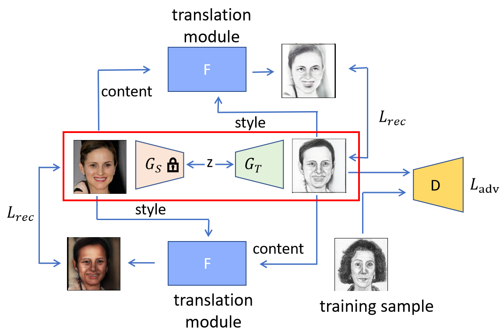

# PIR
few shot image generation via style adaptation and content preservation
#Overview

Our method help align the spatial structural information between source and target GAN to assist adaption.

  

## Requirements

**Note:** The base model is taken from [Few-shot-gan-adaptation](https://github.com/WisconsinAIVision/few-shot-gan-adaptation)'s implementation from [@WisconsinAIVision](https://github.com/WisconsinAIVision)

- Linux
- NVIDIA GPU + CUDA CuDNN 10.2
- PyTorch 1.7.0
- Python 3.6.9
- Install all the libraries through `pip install -r requirements.txt` 
